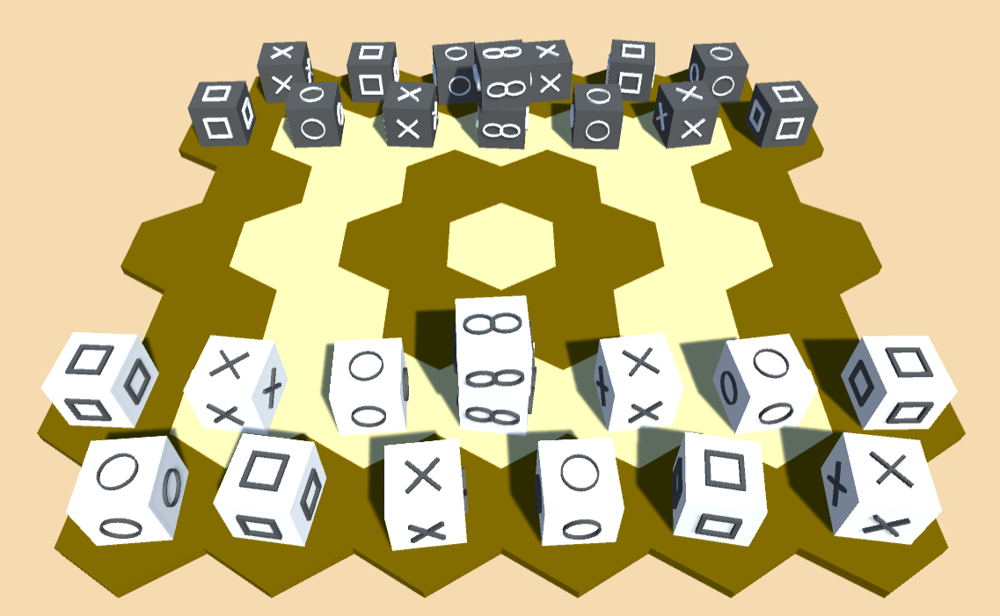

# pijersi-unity
This project is a 3D Unity version of the [Pijersi game](https://github.com/LucasBorboleta/pijersi).

The sister projet [pijersi-engine](https://github.com/arthur-liu-lsh/pijersi-engine) provides the AI.
It is needed in order to build the project. Drop the wrap_csharp folder generated by the pijersi-engine project in the Assets/PijersiEngine folder.

## Requirements
* Unity 2021.3.6+
* Input System 1.3+
* TextMeshPro 3.0.6+
* Unity UI
